<div align="center">


<br />

[](https://www.linkedin.com/in/gksriharsha/)
[](https://gksriharsha.medium.com/)
[](https://github.com/gksriharsha)


</div>

<br />

## About

I work at the seam between machine learning and infrastructure — the part where a model has to live inside a real API, query a real database, and answer in real time.

Most of what I build starts as a question I couldn't find a clean answer to. *How do you actually store a family tree so that "second cousin twice removed" is one query instead of ten?* *How fast is the same classifier in Python versus Java versus C, honestly measured?* The repos below are those questions, worked out in code.

```text
  Focus       Machine learning systems, graph data modeling, backend APIs
  Building    Flask + JanusGraph traversal engine for arbitrary family structures
  Exploring   Vector search, distributed training, MLOps tooling
  Writing     Long-form build logs on Medium — Gremlin, layout algorithms, feature selection
```

<br />

## Why a graph database

Resolving "first cousins" in a relational schema takes several self-joins and a recursive CTE. In a graph it is a single traversal: walk up two `child_of` edges, then back down two. Below is that query running against the family tree.

<div align="center">

<picture>
  <source media="(prefers-color-scheme: dark)" srcset="assets/traversal-dark.svg" />
  <source media="(prefers-color-scheme: light)" srcset="assets/traversal-light.svg" />
  
</picture>

</div>

<br />

## Tech

<table>
<tr>
<td valign="top" width="50%">

**Machine Learning**


</td>
<td valign="top" width="50%">

**Backend**


</td>
</tr>
<tr>
<td valign="top" width="50%">

**Data & Storage**


</td>
<td valign="top" width="50%">

**Frontend & Tooling**


</td>
</tr>
</table>

<br />

## Projects

<table>
<tr>
<td width="50%" valign="top">

### 🌳 Family Tree

A genealogy engine built on a **graph database** instead of a relational one — so "who is my great-grandmother's brother?" is a single Gremlin traversal, not a pile of recursive joins. Includes an auto-layout algorithm that keeps generations readable no matter how tangled the tree gets.


**[API →](https://github.com/gksriharsha/Flask-Family-Tree)** &nbsp;·&nbsp; **[UI →](https://github.com/gksriharsha/Family-Tree-UI)** &nbsp;·&nbsp; [Write-up](https://gksriharsha.medium.com/designing-the-layout-of-a-family-tree-2-ff226aa40152)

</td>
<td width="50%" valign="top">

### ❄️ Svalbard

A seed vault for ML benchmarks. Runs the *same* classification task across languages and frameworks, then records runtime and accuracy in one queryable database — so "which is faster" stops being folklore and starts being data.


**[Core →](https://github.com/gksriharsha/Svalbard)** &nbsp;·&nbsp; **[Service →](https://github.com/gksriharsha/Svalbard-SpringBoot)**

</td>
</tr>
<tr>
<td width="50%" valign="top">

### 📉 RSFS

**Random Subset Feature Selection** — a dimensionality-reduction algorithm that scores features by how often they prove useful across many random subsets, rather than ranking them one at a time. Implemented in Python, with a full write-up of the method.


**[Repo →](https://github.com/gksriharsha/RSFS)** &nbsp;·&nbsp; [Paper walkthrough](https://gksriharsha.medium.com/random-subset-feature-selection-a-dimensionality-reduction-approach-8f2b3876acd8)

</td>
<td width="50%" valign="top">

### 🎛️ Classifier Workbench

A desktop GUI for throwing one dataset at several classifiers at once and comparing them side by side — so model selection becomes something you *look at* rather than something you script from scratch every time.


**[GUI →](https://github.com/gksriharsha/MultipleClassifier-GUI)** &nbsp;·&nbsp; **[Pipeline →](https://github.com/gksriharsha/AutomatedLearning)**

</td>
</tr>
</table>

<br />

## Writing

I write long-form build logs — the reasoning and the dead ends, not just the finished code.

- [10 Most Used Functions in Gremlin](https://gksriharsha.medium.com/10-most-used-functions-in-gremlin-3-3c121da6d958) — the traversal vocabulary that covers 90% of real graph queries
- [Designing the Layout of a Family Tree](https://gksriharsha.medium.com/designing-the-layout-of-a-family-tree-2-ff226aa40152) — why generic graph layout algorithms fail on genealogies
- [Random Subset Feature Selection](https://gksriharsha.medium.com/random-subset-feature-selection-a-dimensionality-reduction-approach-8f2b3876acd8) — a dimensionality reduction approach

**[All posts on Medium →](https://gksriharsha.medium.com/)**

<br />

## Stats

<div align="center">

<picture>
  <source media="(prefers-color-scheme: dark)" srcset="assets/stats-dark.svg" />
  <source media="(prefers-color-scheme: light)" srcset="assets/stats-light.svg" />
  
</picture>

<picture>
  <source media="(prefers-color-scheme: dark)" srcset="https://streak-stats.demolab.com?user=gksriharsha&hide_border=true&background=0D1117&stroke=30363D&ring=58A6FF&fire=58A6FF&currStreakLabel=58A6FF&sideLabels=C9D1D9&currStreakNum=C9D1D9&sideNums=C9D1D9&dates=8B949E" />
  <source media="(prefers-color-scheme: light)" srcset="https://streak-stats.demolab.com?user=gksriharsha&hide_border=true&background=FFFFFF&stroke=D0D7DE&ring=1F6FEB&fire=1F6FEB&currStreakLabel=1F6FEB&sideLabels=24292F&currStreakNum=24292F&sideNums=24292F&dates=57606A" />
  
</picture>

</div>

<br />

## Let's talk

I'm open to **machine learning and backend engineering roles**, and to collaborating on anything involving graph data, ML infrastructure, or benchmarking systems honestly.

The fastest way to reach me is LinkedIn — or open an issue on any repo here if it's about the code.

<div align="center">

[](https://www.linkedin.com/in/gksriharsha/)
<!-- Add your email below if you want it public — replace the address, then delete this comment.
[](mailto:you@example.com)
-->

</div>

<div align="center">


<sub>Thanks for scrolling this far.</sub>

</div>
